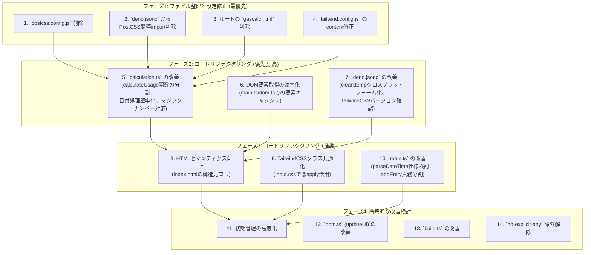

# GasCalc リファクタリング計画 (2025/05/11 更新版)

## 1. はじめに

このドキュメントは、GasCalc
プロジェクトの継続的な改善と保守性向上を目指すためのリファクタリング計画です。これまでのレビューとユーザー様からのフィードバックに基づき、具体的な作業項目とその優先順位を定義します。

## 2. リファクタリングのフェーズとタスク

リファクタリングは以下のフェーズで段階的に実施します。

### フェーズ1: ファイル整理と設定修正 (最優先)

これらのタスクは、プロジェクトのクリーンアップと設定の最適化を目的とします。

1. **`postcss.config.js` の削除:**
   - PostCSS
     を使用しなくなったため、この設定ファイルをプロジェクトから削除します。
2. **`deno.jsonc` から PostCSS 関連 import の削除:**
   - `deno.jsonc` ファイル内の `imports` セクションから、`postcss` および
     `autoprefixer` に関連するエントリを削除します。
3. **ルートディレクトリの `gascalc.html` の削除:**
   - リファクタリング前の古い `gascalc.html`
     ファイルをプロジェクトルートから削除します。現在の成果物は
     `dist/gascalc.html` です。
4. **`tailwind.config.js` の `content` プロパティ修正:**
   - `tailwind.config.js` ファイル内の `content` 配列から、不要なエントリ
     `./src/styles/output.css` を削除します。TailwindCSS は HTML や TypeScript
     ファイル内のクラスをスキャン対象とします。

### フェーズ2: コードリファクタリング (優先度 高)

これらのタスクは、コードの品質、保守性、堅牢性を大幅に向上させることを目的とします。

5. **`src/utils/calculation.ts` の改善:**
   - `calculateUsage`
     関数内の複雑なロジックを、責務の明確な複数の小さなヘルパー関数に分割します。
   - 日付操作ロジック（月またぎ、年末年始など）の堅牢性を高めます。必要に応じて日付ユーティリティ関数を作成または改善します。
   - マジックナンバー（例:
     `0.79`）には意味のある定数名を付与するか、コードコメントでその意味を明確にします。
   - 関連するユニットテスト (`tests/calculation.test.ts`)
     をリファクタリングに合わせて更新します。
6. **DOM 要素取得の効率化:**
   - `src/main.ts` の `initialize` 関数内、または `src/utils/dom.ts`
     のモジュールスコープ（ファイルのトップレベル）で、頻繁にアクセスされる主要な
     DOM
     要素を一度だけ取得し、定数または変数にキャッシュします。これにより、`document.getElementById`
     の呼び出し回数を削減します。
7. **`deno.jsonc` の改善:**
   - `clean:temp` タスクをクロスプラットフォーム対応にします。例えば、Deno の
     `Deno.remove()` API を使用する簡単な Deno
     スクリプトを作成し、タスクから呼び出すように変更します。
   - 使用している TailwindCSS のバージョン（現在
     `^4.1.5`）がプロジェクトの意図と合致しているか再確認し、必要であれば調整します。

### フェーズ3: コードリファクタリング (推奨)

これらのタスクは、コードの可読性、保守性、および開発体験をさらに向上させることを目的とします。

8. **HTML セマンティクスの向上 (`src/index.html`):**
   - 現在の `div` 要素中心の構造を見直し、`<header>`, `<main>`, `<footer>`,
     `<section>`, `<nav>`, `<article>`, `<aside>` といった HTML5
     のセマンティック要素を適切に使用します。
9. **TailwindCSS クラスの共通化:**
   - `src/index.html` 内で繰り返し使用される TailwindCSS
     のユーティリティクラスの組み合わせを特定します。
   - これらの共通スタイルセットを `src/styles/input.css` 内で `@apply`
     ディレクティブを使用してカスタムクラスとして定義し、HTML
     側ではそのカスタムクラスを適用することで記述を簡潔にします。
10. **`src/main.ts` の改善:**
    - `parseDateTime`
      関数における日付省略時の挙動（特に初回入力時）について、ユーザーにとってより直感的か検討し、必要であれば仕様を調整します。
    - `addEntry`
      関数内の入力値バリデーションロジックなどを、独立した関数に切り出すことを検討します。

### フェーズ4: 将来的な改善検討

これらのタスクは、プロジェクトのさらなる成長や要求の変化に応じて検討します。

11. **状態管理の高度化:** アプリケーションの状態変数（`entries`, `lastDate`
    など）を、より集約的で管理しやすい方法（例:
    クラスや専用オブジェクト）に移行することを検討します。
12. **`src/utils/dom.ts` (`updateUI`) の改善:** `updateUI`
    関数の責務分割や、イベントリスナーの管理方法（イベントデリゲーションなど）の最適化を検討します。
13. **`build.ts` の改善:** esbuild
    からのエラーや警告をより詳細にコンソールに出力するなど、ビルドスクリプトのデバッグ情報や堅牢性を向上させます。
14. **`no-explicit-any` 除外解除:** `deno.jsonc` のリンタールールから
    `no-explicit-any`
    の除外を解除し、プロジェクト全体の型安全性をさらに高めることを目指します。

## 3. 重要な注意点

- **段階的な実施とテスト:**
  各リファクタリングタスクは、可能な限り小さな単位で実施し、各ステップの完了後には
  `deno test`
  コマンドでユニットテストを実行し、アプリケーションの動作確認を行ってデグレード（機能低下）を防ぎます。
- **Memory Bank の更新:**
  リファクタリングの進捗や大きな変更があった場合は、`memory-bank/`
  ディレクトリ内の関連ドキュメント（特に `activeContext.md`,
  `systemPatterns.md`, `techContext.md`, `progress.md`）を適宜更新します。
- **TailwindCSS デザイン問題:** TailwindCSS
  のデザインが適用されるようになったとのことですが、引き続き表示に問題がないか注意し、必要であれば調整します。

---
